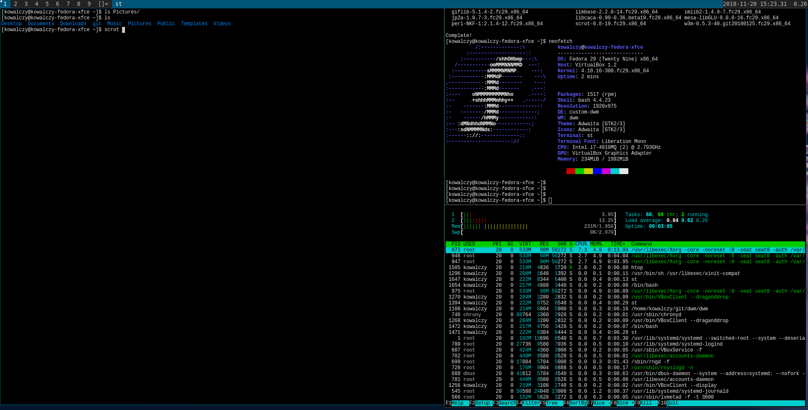

# How to install and configure DWM at Fedora 29



This manual was moved here from [https://jacek_kowalczyk@bitbucket.org/jacek_kowalczyk/notatki-md.git](https://jacek_kowalczyk@bitbucket.org/jacek_kowalczyk/notatki-md.git)


```
sudo dnf install dwm git dmenu st
git clone git://git.suckless.org/dwm
cd dwm 

sudo dnf install libX11-devel
sudo dnf install libXft-devel
sudo dnf install libXinerama-devel

sudo dnf install nitrogen
sudo dnf install xorg-x11-xinit-session

```

* edit config.mk file 

```
commit 7a013dd1af0bb0fb50ea4496910c98c53c7dd840 (HEAD -> kowalczy-dwm-fedora)
Author: Jacek Kowalczyk <jacekkowalczyk82@gmail.com>
Date:   Tue Nov 20 14:25:20 2018 +0100

    compil;e at fedora

diff --git a/config.mk b/config.mk
index 25e2685..7d6d132 100644
--- a/config.mk
+++ b/config.mk
@@ -7,8 +7,8 @@ VERSION = 6.1
 PREFIX = /usr/local
 MANPREFIX = ${PREFIX}/share/man

-X11INC = /usr/X11R6/include
-X11LIB = /usr/X11R6/lib
+X11INC = /usr/include/X11
+X11LIB = /usr/lib64/X11

 # Xinerama, comment if you don't want it
 XINERAMALIBS  = -lXinerama


```

* edit config.def.h file and the same change in config.h file

```
commit 3181727ff56be4fd4d9347a5117d68b90301dc1d (HEAD -> kowalczy-dwm-fedora)
Author: Jacek Kowalczyk <jacekkowalczyk82@gmail.com>
Date:   Tue Nov 20 14:30:09 2018 +0100

    Windows Key as ModKey

diff --git a/config.def.h b/config.def.h
index 1c0b587..0bf6c2a 100644
--- a/config.def.h
+++ b/config.def.h
@@ -44,7 +44,7 @@ static const Layout layouts[] = {
 };

 /* key definitions */
-#define MODKEY Mod1Mask
+#define MODKEY Mod4Mask
 #define TAGKEYS(KEY,TAG) \
        { MODKEY,                       KEY,      view,           {.ui = 1 << TAG} }, \
        { MODKEY|ControlMask,           KEY,      toggleview,     {.ui = 1 << TAG} }, \

```
* rebuild by `sudo make clean install`

* edit ~/.xinitrc file 

```
exec nitrogen --restore &
while true ; do xsetroot -name "`date '+%Y-%m-%d %H:%M.%S'` Load15: `cat /proc/loadavg |cut -d " " -f 3`; `uptime -p `"; sleep 1 ; done &
exec /home/kowalczy/git/dwm/dwm


```

* ln -s ~/.xinitrc ~/.xsession
* chmod 755 ~/.xsession

* on next login select User Script session 

* sudo nano /usr/share/xsessions/custom-dwm.desktop 

```
[Desktop Entry]
Name=Kowalczy-DWM
Exec=/usr/libexec/xinit-compat
```

* on next login select kowalczy-DWM session

# Building custom Fedora spin with DWM 

* Packages to install 

```
sudo dnf install livecd-tools spin-kickstarts 
ls -alh /usr/share/spin-kickstarts/
cp /usr/share/spin-kickstarts/fedora-live-xfce.ks /priv-data/data/fedora-dwm-custom/fedora-dwm-spin/fedora-live-xfce-dwm.ks
cp /usr/share/spin-kickstarts/fedora-live-mate_compiz.ks /priv-data/data/fedora-dwm-custom/edora-dwm-spin/fedora-live-mate-dwm.ks
cp /usr/share/spin-kickstarts/fedora-live-kde-base.ks /priv-data/data/fedora-dwm-custom/fedora-dwm-spin/fedora-live-kde-base-dwm.ks
cp /usr/share/spin-kickstarts/fedora-live-kde.ks /priv-data/data/fedora-dwm-custom/fedora-dwm-spin/fedora-live-kde-dwm.ks
cp /usr/share/spin-kickstarts/fedora-live-lxqt.ks /priv-data/data/fedora-dwm-custom/fedora-dwm-spin/fedora-live-lxqt-dwm.ks

#sudo dnf install system-config-kickstart # this does not work 

```

* Building 

```
cd /priv-data/data/fedora-dwm-custom/fedora-dwm-spin

# remove old image file system files 
sudo rm -rf ./tmp/imgcreate-*

ISO_NAME="Fedora-DWM-XFCE-`date '+%Y-%m-%d-%H%M'`" 
sudo livecd-creator --verbose \
--config=fedora-live-xfce-dwm.ks \
--fslabel=${ISO_NAME} \
--cache=./build-cache/ --tmpdir=./tmp/ 2>&1 | tee -a ${ISO_NAME}.log 

sha256sum ${ISO_NAME}.iso |tee -a ${ISO_NAME}.iso.sha256sum.txt

ISO_NAME="Fedora-DWM-MATE-`date '+%Y-%m-%d-%H%M'`" 
sudo livecd-creator --verbose \
--config=fedora-live-mate-dwm.ks \
--fslabel=${ISO_NAME} \
--cache=./build-cache/ --tmpdir=./tmp/ 2>&1 | tee -a ${ISO_NAME}.log 

sha256sum ${ISO_NAME}.iso |tee -a ${ISO_NAME}.iso.sha256sum.txt


ISO_NAME="Fedora-DWM-KDE-`date '+%Y-%m-%d-%H%M'`" 
sudo livecd-creator --verbose \
--config=fedora-live-kde-dwm.ks \
--fslabel=${ISO_NAME} \
--cache=./build-cache/ --tmpdir=./tmp/ 2>&1 | tee -a ${ISO_NAME}.log 

sha256sum ${ISO_NAME}.iso |tee -a ${ISO_NAME}.iso.sha256sum.txt


ISO_NAME="Fedora-DWM-light-`date '+%Y-%m-%d-%H%M'`" 
sudo livecd-creator --verbose \
--config=fedora-live-dwm-ultra-light.ks \
--fslabel=${ISO_NAME} \
--cache=./build-cache/ --tmpdir=./tmp/ 2>&1 | tee -a ${ISO_NAME}.log 

sha256sum ${ISO_NAME}.iso |tee -a ${ISO_NAME}.iso.sha256sum.txt


ISO_NAME="Fedora-DWM-LXQT-`date '+%Y-%m-%d-%H%M'`" 
sudo livecd-creator --verbose \
--config=fedora-live-lxqt-dwm.ks \
--fslabel=${ISO_NAME} \
--cache=./build-cache/ --tmpdir=./tmp/ 2>&1 | tee -a ${ISO_NAME}.log 

sha256sum ${ISO_NAME}.iso |tee -a ${ISO_NAME}.iso.sha256sum.txt

```
